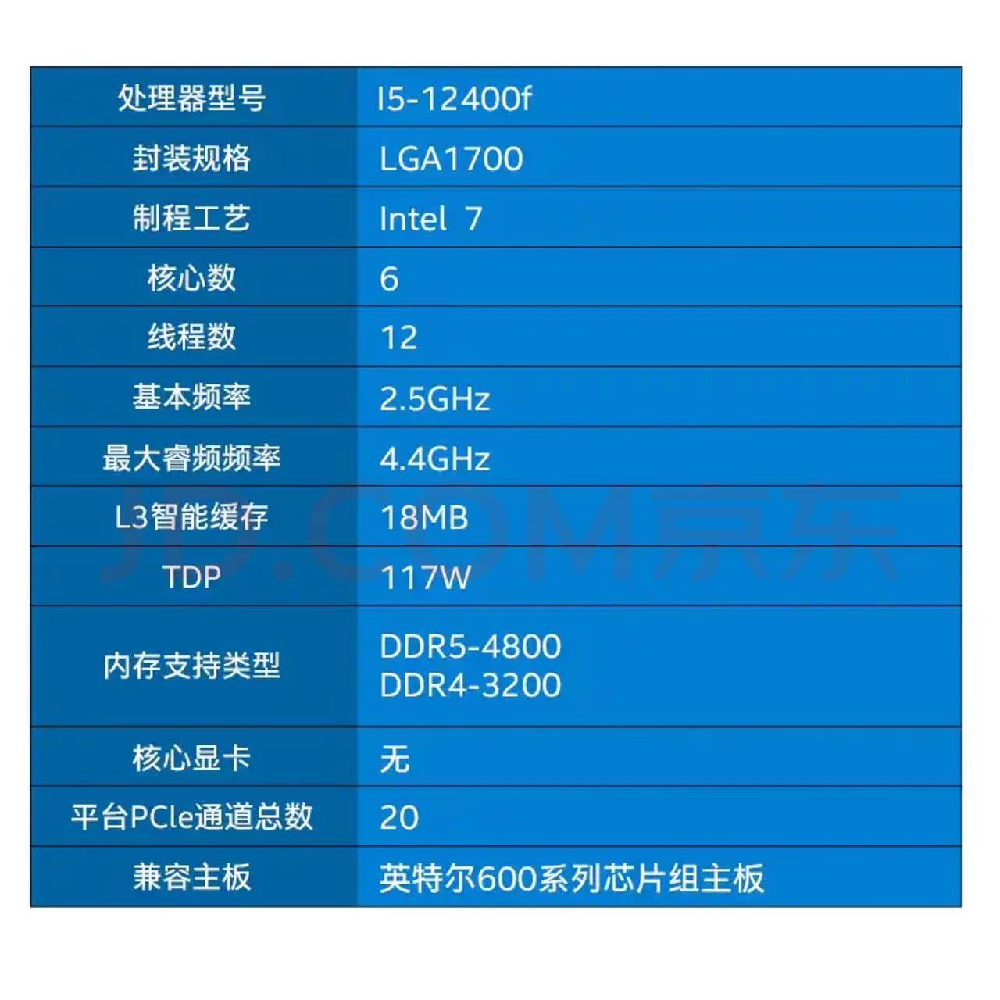

# CPU
作为电脑的最核心的大脑，你很有必要知道它的全称是什么：central processing unit ,cpu 就像一个电脑的大脑一样。
cpu 有很多的不同的传输信息的电路，每一个cpu都存在一个特殊的电路以恒定的速度定期开关让所有东西保持同步，这个电路
我们称为clock，而clock 的单位一般都是gHZ，g代表十亿，hz代表单位每秒，也就是说cpu的时钟的单位是非常快的，能达
到每秒十亿的频率。但是cpu的时钟每个周期做的事情又是非常简单的。

## 目录
- [解读京东商城CPU的参数](###解读一下京东上面的CPU参数)
- [CPU是如何读写RAM设备](###CPU是如何读写RAM设备)
    - [读RAM](###读RAM)
    - [写RAM](###写RAM)
- [CPU指令集](###cpu指令集)
- [CPU内部结构](###cpu内部结构)
    - [理解逻辑运算单元](####理解逻辑运算单元)
    - [ALU如何将计算的结果告诉控制单元](####ALU如何将计算的结果告诉控制单元)
    - [几个重要的寄存器](####几个重要的寄存器)


### 解读一下京东上面的CPU参数

- 核心数量：代表存在6个cpu核心
- 线程数：代表能够同时计算的线程数，这里运用的是超线程计算，现代计算机不论inter 还是arm 都是拥有这类技术
一般来说一个核心可以同时运行两个线程是没什么问题，但是这里要注意，是同时运行，不是给你cpu时钟切割时间片的那种
看起来同时运行的情况。
- 基本频率： 代表这个cpu每秒时钟切换25亿次
- 睿频频率：代表这个cpu在程序运行情况下能自动切换成最高的频率状态就是4.4*10亿次
- L3 ：代表cpu内部的l3级缓存状态
- TDP： 释放的热量，因为cpu原理就是电路的开闭，必然会导致功率的消耗和热量的转化，这个就是热量的一个指标
- PLC： 局部高速通道，一般来说显卡和内存就会走PLC


### CPU是如何读写RAM设备
内存在英文有个缩写：RAM （random access memory）,随机访问内存，尽管cpu大部分情况下是顺序访问内存的，但是也难免
会碰到随机访问，RAM就是提供随机访问内存，RAM地址只是一系列代表开关电路的0和1。
#### 读RAM
当计算机开始进行访问的时候 
- cpu会下发一个指令给到内存通过address bus ，地址总线，比如获取到0110000这个地址的内容
- 但是注意一点，此时内存不会响应cpu，直到cpu接通control bus（控制总线），control bus 有两条线，一条是enable
一条是set，如果enable没有被设置，RAM将不会响应cpu，如果enable被开启了，那么RAM就会将数据发送给cpu
- RAM 将0110000这个地址内容通过 data bus （数据总线）返回给cpu 
- 重复... 

这里总结一下，我们cpu和RAM之间存在三条总线：address 、 data、 control， cpu通过address 总线发送地址给内存
告诉内存我要这个地址的内容，ram 判断控制总线的enable电路是否能通，如果通了就将地址发送到data 总线上去，重复如此
操作
#### 写RAM
- cpu 会走address下发一个地址 ： 01110000
- cpu 通过data 总线下发数据： 1111111
- cpu 设置control 总线的set线路为联通

此时cpu 就可以将01110000的地址的内容写入1111111了。


### cpu指令集
在上面的内存中存放的数据都是哪些类型，第一个类型就是指令，但是RAM内存中存放的一些指令需要我CPU能够理解它，所以这个指令就
只能由CPU来确定，所以这些指令也称为cpu指令集。当然每个平台的指令集都是不同的，在ARM 和inter 两个平台的指令就是不相同的，
同样的一个意思，表达不同，所以在程序编译时需要区分不同的平台这也是重要原因之一。虽然不同的平台的cpu指令集都不相同，但是表达
意思都是相通的，所以我检出了一下最常见的一些指令出来了：
- load
- add 
- store
- compare
- jump if condition
- jump
- out
- in 

这里其实没啥特殊的难以理解的，这里就是平常的一些指令


### cpu内部结构

- 控制单元 : 真正的电脑大脑，以指令的形式从RAM中获取到要做的事情，分解并发送这些指令给其他部件
- 运算单元 : 逻辑运算单元 ，进行所有的运算，存在两个输入单元：inputA 和inputB
- 存储单元 : 一般指寄存器组，就是所有的寄存器的集合以及cpu内部的多级缓存


关于cpu内部整体逻辑我们需要关注几个部分的协调：
1. 控制单元如何与运算单元进行交互
2. 控制单元如何与存储单元进行交互


#### 理解逻辑运算单元
逻辑运算单元的字面含义就是将输入的内容进行运算并输出结果。我们就知道了首先我们需要输入部分，还需要能识别指令的部分，还需要
输出部分，但是如果说我们进行输出，如果只需要我们比较大小的话，我们输出一个完整的值，那岂不是浪费总线的使用，所以这里我们需要
分成两个部分来进行分别看待。

- 当ALU的指令是获取结果
````
一般来说从ALU出来的东西会优先放到寄存器中去：register， ALU计算出来的东西先放到了寄存器中
知道control unit 接通了set电路后才会被放入寄存器中。这里还有一个过程：当我们准备将一个
数字从寄存器中移出来的时候，我们需要另外一条enable电路，当enable 和寄存器联通的时候，寄存器
输出电路连接到cpu总线上
````
1. 单元内容A变量 在inputA输入，单元内容B变量在inputB输入
2. RAM将指令给到控制单元，控制单元告诉ALU执行那个命令（cpu instruction set）
3. ALU算出结果准备存入register，controll 打开register 的set电路，结果存入register寄存器中
 
- 当ALU的指令是比较大小
```` 
一般来说在ALU运算过程中存在一种现象就是需要输出但是并不需要具体的结果，比如比较两个值，我只需要知道那个值比较小
ALU会通过FLag 来进行通知给控制单元。
````
1. 单元内容A变量 在inputA输入，单元内容B变量在inputB输入
2. RAM将指令给到控制单元，控制单元告诉ALU执行那个命令（cpu instruction set）
3. ALU比较出大小，将内容告诉flag寄存器，flag寄存器会将内容告诉控制单元以便下一步操作

#### ALU如何将计算的结果告诉控制单元
在上面我们讲过ALU将内容算出来后，会将内容存放到寄存器中，此时需要控制单元先给寄存器的set电路通电，通电后，ALU就
成功将内容存放到了寄存器中，如果我此时需要将寄存器的内容拿出来，控制单元只需要将寄存器的enable电路进行通电，通电
后寄存器就会将自身的内容输出到总线上，此时控制单元就只需要决定将这个数字存入哪个寄存器，就直接开启对应寄存器的set
电路。

但是总线也是存在缺点的，它在同一个时间内只能接受一个数字，因为线路的大小问题。那么就会出现一个问题，如何进行ALU
输入，不可能将数据又存在ALU里面，本身ALU就是进行运算的。 那么这里就会出现一个临时寄存器，比如控制单元目前需要计算
一个A+B，此时AB都在数据寄存器中，但是总线一次又只能运输一个，要么运输A要么运输B，那么控制单元会控制数据寄存器A的
enable电路打开，此时A就会被输出到总线，然后又打开临时寄存器的set总线，此时A就从总线到了临时寄存器。此时再将B的enable
线路打开，B就会跑到总线上去，ALU将AB的inputa、inputb 输入打开直接就可以将数据输入到ALU中进行计算。所以临时寄存器
也不需要enable线路，因为它只对ALU开放

#### 几个重要的寄存器
寄存器我会单独使用一篇文章来讲解，但是在这里你需要知道的一部分寄存器。
- 临时寄存器： 
- flag 寄存器 ： 将比较结果放在这里
- data 寄存器 ： 存在几个data寄存器，用户数据操作的时候临时存放的
- instruction 寄存器 ： 会提前将RAM的下一个指令读进来
- instruction address 寄存器 ： 和是上面的区别在于我并不知道下一个是指令还是数据，所以会把地址先读进来
- memory  address 寄存器 ： 当cpu执行下一个指令，会将instruction address 的内容放到总线，然后去发送个主存
但是实际上是先发送给memory address， 这个寄存器就告诉RAM下一个需要的地址是哪里，RAM就返回对应的数据


