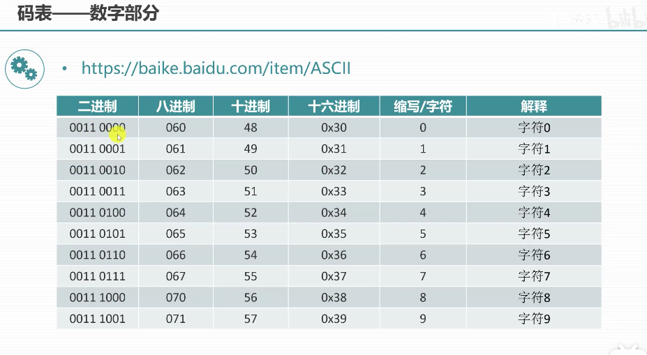
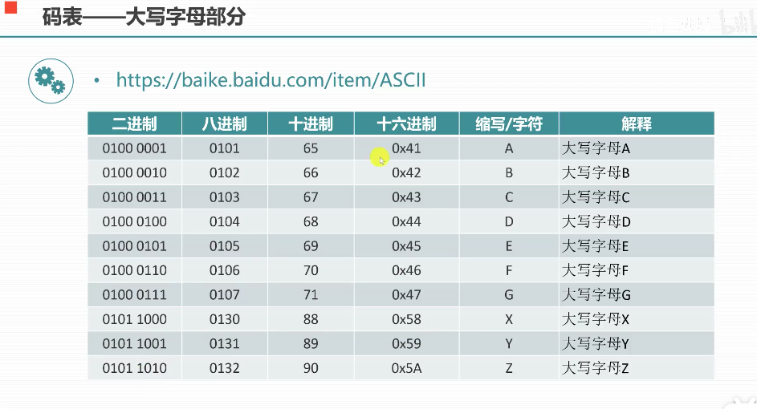
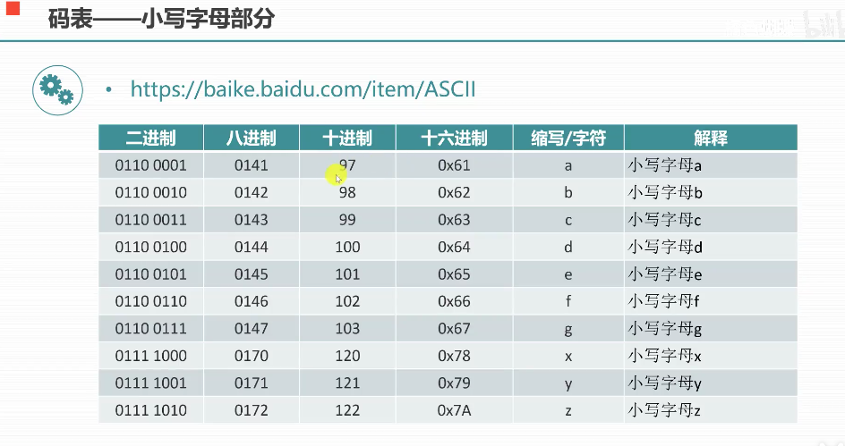

# Ascll
目前计算机中用得最广泛的字符集及其编码，是由美国国家标准局(ANSI)制定的ASCII码（American Standard Code for In
formation Interchange，美国标准信息交换码），它已被国际标准化组织（ISO）定为国际标准，称为ISO 646标准。适用于
所有拉丁文字字母，ASCII码有7位码和8位码两种形式。

##目录
- [码表](##码表)

### 码表
- 0~9 的ascll 值范围：48~57
- A-Z 的ascll 值范围：65~90
- a~z 的ascll 值范围：97~122

### 汉子内码