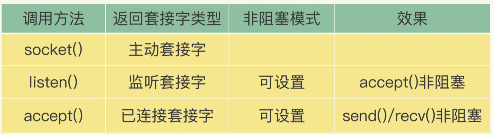

# IO模型
redis 是单线程的，但是单呢又单的不是那么纯粹，它的多线程我们暂时避开不谈，这章用于梳理一下redis的IO
模型，简单的梳理一下为什么单线程读写可以这么快。

## 目录
- [多线程模型的优缺点](###多线程模型的优缺点)
- [单线程为何能这么快](###单线程为何能这么快)
    - [一个连接建立的过程](###一个连接建立的过程)
    - [多路复用](###多路复用)

### 多线程模型的优缺点
多线程模型在很多人看来是解决网络并发的银弹，其实也确实，如果说你机器很好但是你只能使用单线程，那么你的其他
cpu核心很难被利用上就是一个资源浪费。首先说到多线程的时候我们先说说优点吧

优点
- 提高程序并发处理的能力，加大程序吞吐量
- 提高cpu的利用率，让资源得以有效的利用
- 适合阻塞性程序的设计和应用

缺点
- 1.共享资源的时候需要加锁等待，使用并发原语进行控制，增加了编写程序的难度
- 2.需要对线程进行管理从而增加额外的cpu开销，线程的上下文切换也是额外需要负担的开销

###单线程为何能这么快
那么使用了单线程的redis为何可以这么快？其实得益于redis的优秀的数据结构设计以及多路复用机智。这的从几个
方面来进行理解：1.一个链接是如何建立的，建立了一个链接如何进行通讯 。 2.为何可以建立多个连接，建立了多个连接
还是同时处理多个连接的请求这不是多线程干的活吗？ 3.什么是多路复用。

#### 一个链接建立的过程
其实说到这里无非是基于tcp连接进行交互的，我不是强调一个tcp连接怎么建立的，我想强调的是服务端如何接收这个请求并
通过什么样的方式建立连接的。
网络IO存在几个内容：
- 1.bind && listen ： 绑定和监听
- 2.accept  ： 接收请求
- 3.recv    ：读取连接中的请求
- 4.parse   

这里存在几个点容易导致阻塞，accept 和recv，如果看过golang http设计的底层代码，其实recv是一个for循环
一直读取连接中的东西，这是一个阻塞操作，而且accept如果一直没有建立成功，也会一直阻塞。那么一个tcp连接请求
过来 ，调用一个socket（）方法返回一个主动套接字，然后调用listen（）方法，将主动套接字转化为监听套接字，
最后调用accept方法接收到达的客户端连接，并返回已连接套接字

以上就是一个链接建立的过程了。

#### 多路复用
在上面我的 一个链接建立过程中，我们知道，redis是通过 -> socket() -> listen（）-> accept（）这样的一个
建立连接的过程，将主动套接字变成已连接套接字，从而连接变成已连接状态。而且从listen、accept过程中都不需要这样
阻塞。

然而真正实现多路复用的是谁呢，就是linux的机制，可以让一个线程处理多个io流的操作。该机制允许内核中同时存在多个`
监听套接字和已连接套接字`。从代码层面将已监听套接字和已连接套接字绑定到线程上，但是实际流程是内核监听套接字，收到
消息后将消息投递给线程。这就实现了多路复用。

针对不同的消息，select/epoll 提供了针对基于事件的回调机制，在做线程绑定的时候将对应的事件类型和处理函数在select
上进行注册，select/epoll监听到不同的消息到达，调用相应的处理函数即可。其实这里听起来好像又是多线程了，但是实际上
一般来说事件是放到了一个队列，然后redis对这个队列事件进行不断的处理