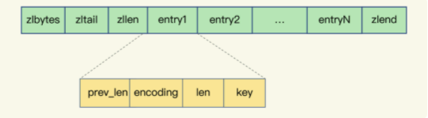

# ziplist
zip list 翻译一下就是压缩链表，这是一种非常节省空间的数据结构。说是压缩链表，其实本质就是一个字节数组。
今天来讲压缩列表，主要就是分析它的空间内存大小，所以要对每一个数据相对敏感才行

## 目录
- [ziplist的内部组成](###ziplist的内部组成)
- [entry的组成](##entry的组成)

### ziplist的内部组成

可以看到这种数据结构组成部分

- zlbytes :列表长度，列表总共占用多少字节，限制是4个字节，所以压缩列表总共有，所以总共就是2^32-1 个字节长度
- zltail : 列表尾部的偏移量，就是指向列表尾部的entry偏移量，不是指向zlend，要区分一下，受zlbytes影响只能4个字节
- zllen : 列表的个数，最大个数为2^16 -1个数，没有统计值
- entrys ： 具体的个数。具体存储元素，可以是字节数组或者整数，长度不限
- zlend ： 列表结束的标志 恒为0xff，一个字节

重点分析一下内存占用情况
- zlbytes ： 4个字节
- zltail： 4个字节
- zllen： 2个字节
- zlend: 1个字节 0xff =255 

可以看到处理entry 外，总共只需要11个字节来存储ziplist

### 可以看到entry的组成

- previous_entry_length : 前一个元素的字节
- len ： 自身长度 4个字节表示；
- encoding ： 编码方式 ，1个字节
- content： 具体的内容，实际保存的数据

其实要注意的是prev_len 这个字段，这个存储的是前一个字段的长度，但是不能取值255，因为啥，因为255被那个zlend占用了
如果存在前面一个值长度刚好为255咋办。其实就是刚好在255基础上+1 ，用100000011来进行存储，就是256表示255，所以单个
元素最大长度2^32-1 ,之所以减一就是255的存在。

pre_len: 的点，如果说前一个值的长度小于等于254的，就用一个字节表示，如果大于254就用5个字节表示，为啥是5个字节呢，因为
整体可容纳的字节数量为zlbytes=4个字节，再加上本身的11个数就要用额外多一个字节表示。