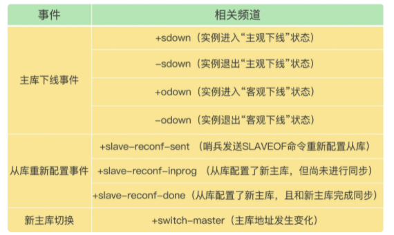

# 哨兵机制

在讲完了主从同步之后其实你会发现一个问题，redis 的主写从读架构好像不是那么合理，因为redis的写始终在
主节点上，那么redis写就是一个单节点，换句话说redis的主节点就是一个单节点，那么这个集群的意义在哪里？
伴随这个问题，可以看看今天这篇文章。

## 目录
- [哨兵是什么](###哨兵是什么)
    - [哨兵的主要任务](####哨兵的主要任务)
    - [主库的下线](####主库的下线)
    - [新主库选举流程](####新主库选举流程)
    - [哨兵选举时的数据写入处理](####哨兵选举时的数据写入处理)
- [哨兵工作原理](####哨兵工作原理)
    - [哨兵通信原理](####哨兵通讯原理)

### 哨兵是什么
哨兵从实体来看就是一个redis的特殊模式下的进程，也就是一个特殊的redis进程，主从库实例运行同时，它也在运行

#### 哨兵的主要任务
哨兵主要有三个任务： 
- 监控： 监控redis集群中所有节点的状态，周期性的发送ping 给所有的redis节点，如果存在节点不同就标记下线
状态，如果主节点ping不通，就开始切换主库流程
- 选主： 当redis的主库不行了就重新选取主库
- 通知： 哨兵通过新主库的信息告诉其他从库，让他们执行replicaof 命令和新主库进行建立连接，并复制数据，同时
哨兵把新主库告诉客户端，让他们把请求发到新主库上


#### 主库的下线
需要知道，主库的下线对于不同对象来说是存在两个状态值：
- 主观下线 ： 主观下线是单个哨兵对主节点的标记
- 客观下线 ： 客观下线是n/2 +1 个节点标记为主观下线

#### 新主库选举流程
需要知道的是新主库的筛选打分制度。简单来说我们在多个从库中按照一定的筛选条件，把不符合条件的从库去掉，我们按照
一定的规则，给剩下的从库逐个打分。将得分最高的从库选为新主库。
- 一定的筛选条件：除了检查从库当前在线状态，还要判断它之前的网络连接状态，具体怎么判断呢？你使用配置项down-after
-milliseconds * 10是我们认定主从库连接最大超时时间 ，这个配置的意思是，如果在down-after-milliseconds 毫秒
内主节点没有链接上网络则被记录一次断连，如果这个次数超过10次，说明从库的网络状况不好，不适合做新主库。

- 优先级打分：可以通过设置slave—priority 配置项设置高
- 偏移差值：和旧主库最小的库得分最高
- ID号大小：ID最小的得分最高


#### 哨兵选举时的数据写入处理
当进行哨兵选举的时候从库的读数据其实并不受影响，但是具体受影响的大概就是写入操作了。当哨兵还没有选出具体的新主库的
时候，这期间的写请求会失败。

对应处理方案其实可以通过后置程序来进行处理，不过更加具体的业务需要结合业务本身的特性来进行优化。如果redis是用来做
旁路缓存的用法，这个时间进行查数据库并记录redis响应错误其实是没什么太大问题，如果是用作数据存储类的操作：
- 异步存储： 建议使用其他中间件做临时存储，查询的话也做一下如果redis没有继续查询其他中间的操作
- 同步报错： 如果是同步操作的话我建议是直接将错误抛出，用户来进行重试

#### 客户端如何结合哨兵进行封装
我们需要知道一个问题，哨兵进行切换，实际上需要客户端订阅一个pubsub ：switch-master 可以获取到最新的这个master
的地址，进行主库切换。但是相对保险的措施是：定时从sentinel中获取一下master节点地址，和上一次链接地址对比是否发生
改变，如果改变就切换库地址发起重新连接。如果没有改变则忽略。

我建议的方式都是两个方式都封装，但是要避免的是重新创建池化链接，比如，a时刻发生master切换，b时刻我们的监控pubsub的
程序获取到了切换信号，发起了切换，切换未完成，c时刻定时器发起对比又发起切换。此时就出现了两次实例化池，这种场景也比较少
所以可以用同步原语进行控制。

#### 哨兵是如何进行工作的
上面讲到哨兵其实是一种特殊的redis进程，不负责读写数据，只提供pubsub等消息通知的功能，具体工作内容是负责集群的监控、
选主、通知等。那么哨兵从一开始是如何进行工作的呢。

##### 哨兵通信原理
- 哨兵之间的发现


首先要注意哨兵如何进行哨兵之间的通讯的。哨兵之间的通讯是基于redis的pub/sub机制，也就是发布订阅机制，哨兵只要和主库
建立了连接就可以在主库发布消息，比如发布自己的链接信息，其他哨兵监听这个channel就可以达到这个目标了。
````
用于主从集群发布通讯的channel ： __sentinel__:hello
````

- 哨兵和从库之间的发现

由哨兵向主库发送info命令，就可以获取到从库的列表，就可以建立哨兵与从库的链接。

- 哨兵的关键性的channel



##### 如何切换主从（两次投票问题）
 第一次投票:标记客观下线
假设目前有：哨兵1、哨兵2、哨兵3

- 哨兵1 和主库ping不通了
- 哨兵1给其他哨兵 发送is-master-down-by-addr
- 哨兵2 赞成哨兵1观点回复 Y
- 哨兵3 不赞成哨兵1观点回复 N

此时哨兵1 的观点有两票赞成 1票反对。此时应该对比赞成票和quorum设置的参数。
一般来说quorum是比较的第一条件，是否大于一半的观点是第二条件。比如，我有三台哨兵，那么quorum设置为2就可以了，那么
这个意思是如果有赞成数量大于等于2 的时候就可以下线主库了。为什么有quorum这个参数呢？不直接需要一半的实例通过就可以了吗？ 

- quorum真正作用其实在第二次投票，其实在第一次投票，如果主库被一半以上的sentinel标记为下线状态，那么主库就被标记
为客观下线。第二次投票就是选取新的master，但是选取master是由一个leader来选取的，所以来选出新的主库实际上是一个
sentinel leader 来进行选取的。

选取新的leader 就要满足两个条件
- 满足quorum 值
- 满足一半以上的节点 的值

第二次选举比第一次选举更加严格。虽然有逻辑上的比较，但是实际测试下来在第一次sentinel投票过程中我们会发现只要达到了
一般的节点投了赞成票，不管达到或者没达到quorum，主库都会被下台。但是在第二次选举中，如果没有同时满足两个条件，那么选举
新的master节点就会失败，失败原因有很多，更多网络原因，如果失败超过了failovertime *2 的时间间隔，那么又会发起选举。
但是记得避免布置双数的sentinel，尽量缩短投票选举时间。

