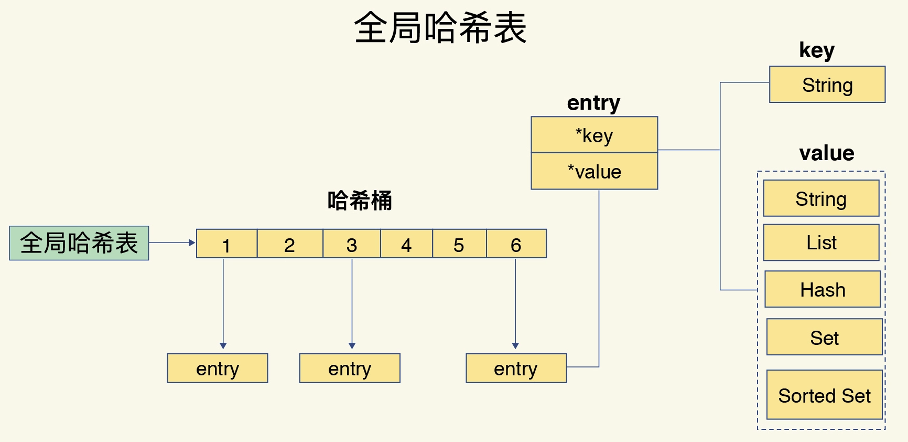
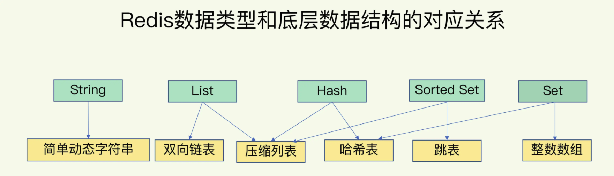

# 基础数据结构
redis 实现了多种数据结构供api调用，其中底层是加了多种更加基础的数据结构进行优化。

## 目录
- [键值对存储](###键值对存储)
- [底层数据结构](###底层数据结构)
- [慢操作](###慢操作)
    
### 键值对存储
我们从redis中获取到一个key 可以使用get key 。基本上所有的key都能被快速访问，而且可以快速del ，expire等
那么我们如何做才能快速的获取一个值的位置呢。
- 全局hash表

其实在数据结构中散列表已经是讲得非常深入了，redis存储所有key的时候就是使用的hash表，那么我把关键点先提炼出来
- redis 全局key是存在一个hash表中
- 全局key 是通过链式表解决hash冲突的
- redis 全局key是通过存储两个hash表进行渐进式的rehash。

#### 全局key具体存的是什么值？
- entry 
全局key存储的内容是一个entry的结构，这个结构包含了两个内容
````
type Entry struct {
	Key *string // string
	*Value  // string 、list 、hash 、set 、sort set
    next *Entry 
}
````


### 底层数据结构
redis的底层数据结构主要有
- 动态字符串
- 整数数组
- 双向链表
- 哈希表
- 压缩列表
- 跳表



### 慢操作
第一方面认清楚redis的数据结构以及对应的时间复杂度，另一方面要知道redis在io读写控制上面是存在性能
上的瓶颈，这类瓶颈是属于硬件方面的瓶颈。

- 范围查询，基本上的范围操作是基于链表进行操作,时间复杂度O(n)
- 

io性能处理的瓶颈
- 避免bigkey ，写入一个bigkey在内存分配上需要消耗更多的时间，每次读写的时候io时间更长。
- 避免复杂度过高的命令，如果有必要的话，建议单独在一个独立的从服务器上读取复杂度高的命令
- 避免大量key 集中过期，redis过期机制都是在主线程上执行的，如果存在大规模key过期容易造成长尾延时
- 淘汰策略，淘汰策略也是在主线程上进行的，也是容易赵成阻塞
- 主从同步：在进行全量同步的时候由于要复制内存页，一旦fork子进程的时候需要复制的页越大，那么阻塞时间越长。
- 并发非常大的时候，redis由于是单线程无法利用到多核cpu的优势