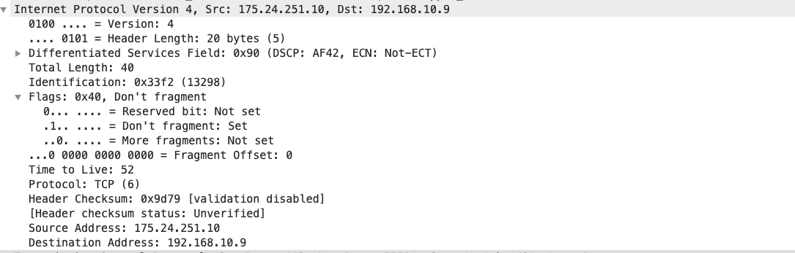

# IP
IP协议是tcp/ip协议簇中的核心协议，也是协议簇中的载体，承载着所有协议传递、寻址功能。但是
要注意的一点是IP协议是无状态、不可靠的协议。

## 目录
- [协议解读](###协议解读)
    - [无状态](#####无状态)
    - [不可靠](#####不可靠)
    - [协议头格式](###协议头格式)
- [协议功能](###协议功能)
- [抓包解读](###抓包解读)
- [header checksum 原理](###header checksum原理)
- [分片传输原理](###分片传输原理)
- [DSCP 原理](###DSCP原理)
### 协议解读
 ##### 不可靠
 ip协议不能保障数据报是否能到达目的地 ，在传输过程中，很可能直接丢弃，举个简单例子
ip协议中存在一个字段ttl ，time to live ，一般设置都是64、128、255 等，每次经过一个路由器
就会减一，当ttl为-1的时候，到达最新的路由的时候那么这个包就会直接被丢弃
##### 无状态
 所谓无状态和http协议类似了，你并不知道那个包是哪个人发出来的，每个包的处理方式都是
独立的，也就表示这个包是无状态的，也可以称为无连接。

##### 协议头格式
所谓的协议头格式指的就是经过IP层，ip需要给上层包加上封装，封装称为一个IP包，这样的步骤就是协议
包。

可以看到上面的协议头的格式。下面我来简单的解释一下
- version ： 长度4bit ，用于表示当前的版本，ipv4 就是4，ipv6就是6
- headerlength： 长度是4bit，但是值得注意的是这个值得单位是32bit，IP头长度
- Differentiated Services Field ：长度8bit，用于为不同的IP数据包定义不同的服务质量，一般应用在QoS技术中，这是
目前通过wireshark进行抓包的内容，可以进行流量控制的实现。也称为DSCP，在上面图中表现为tos：type of servcie
- total length ： 长度为16bit，单位是字节，是IP头+payload总长度
- identification ： 用于分片
- flag ： 用于分片
- fragment offset ： 用与分片
- ttl ： time to live : 数据包的存活，不是时间维度
- protocal ： 上层协议
- header checksum : 检测ip数据包是否被修改，进行校验
- source ： 发送的IP
- destination ： 目标的IP
### 协议功能

可以看到的内容是一个主机A访问主机B。这里面存在两种角色
- 主机： 配有IP地址，但是不能进行路由控制的设备
- 路由器： 配有IP地址，又能进行路由的设备

### 抓包解读
接下来我们根据具体抓包来进行解读一下这个包中IP的内容

- 这个包是基于IPv4的 ：version
- 这个包IP头部长度为： 5*4 =20 个字节 ： header length
- dscp 这个字段暂不解读
- 这个IP包整体长度为40个字节 ：total length 
- id/flag/ 这两个字段先不解读
- 这个包还是存活状态，剩余跳转路由器是52次机会 ： ttl
- 这个包是一个tcp 包： protocal
- 这里是检测的状态，暂时不解读
- 来源的路径
- 目的地的路径

### header checksum 原理
和http协议做摘要校验一样的内容，IP层也有对ip包做校验的算法，我在上面其实没有提到的几个字段在下面会单独拿出来讲解一下，
个人认为理解了这里面的内容，记忆字段必然将不会是什么难题了。这里就要用到我们的一个checksum字段，完整字段叫做header 
checksum ，这里面的内容类似于http中的摘要算法的摘要部分。每次进行ip包获取转发路由都会对这个字段进行校验防止中途被人
篡改。

如何计算得到的Checksum？
- 1.将checksum 字段置为0
- 2.将16bit部分内容 求和
- 3.取反，写入checksum

如何校验checksum ？
- 将16bit部分内容 求和
- 取反码，如果结果为0 则是正常通过，否则丢弃

### 分片传输原理

##### MTU 最大传输单元
通常一个我们的一个http请求可能是一个网页，一个网页大小是很大的，有很多代码内容，图片、链接的内容，那么每次进行传输的话
总不可能所有都能一次性打包发过来吧。

但是http请求是基于tcp的，而IP才是真正服务于tcp的更底层内容。http是一次进行请求渲染，但它并不关心底层tcp或者说IP层是
如何进行传输的，只要让http看起来是一次请求就ok了。那么IP层是如何进行包的大小切分的呢，关键点在于这个MTU这个最大传输
单元。

- 一般而言，ip层都是可以做切分的，分片的坏处就是降低性能，本来一次传输变成多次传输。
- 上层也可以让ip层不做切分，对flag设置don't fragment ,但是碰到网络转发设备不支持超过它本机的MTU的内容就容易丢包

##### MSS 最大分节大小
TCP发送的syn包就有这个选项，它通知到接受端么给TCP分节中的最大数据量。发送端TCP用接受到的MSS值作为发送分节的最大大小。
在TCP的MSS选项中，MSS是一个16位存储的标志，最大值就是65535.这个值TCP协议实现是往往需要用MTU代替（需要减去IP包头的20字节
和TCP的包头的20字节），所以MSS往往就是1500 -40 =1460，因此TCP每次进行数据发送的时候其实已经控制了自己的大小，所以每次
TCP的内容就不会进行IP层分包

##### IP级别的分包原理
在上面告诉了你tcp一般来说是不会进行IP层的分包，因为在tcp中syn包是存在一个选项mss可以告诉知道本次大概要发送多少内容。而且tcp协议
存在一些特点
- 顺序包
- 数据不能分片

但是udp、icmp这类型协议就不支持分段功能了，udp和icmp认为网络是可以传输无限的数据，当这两种协议发送的时候其实并不考虑数据的大小，仅仅
在头部添加udp和icmp首部，然后就交给IP层了。
- IP层分片规则一般是非常暴力的，IP层分包直接会将整个数据切成N个分片，这样的结果导致只有一个IP分片存在udp头部，其他的片段其实是没有的

##### IP层丢包
尽管ip分包过程看起来透明，但是存在一点，即使丢了一片数据也要重新传输整个数据报，因为IP层本身没有超时重传的机制。当tcp某个报文没有达到对应
的主机的时候，tcp会在超时后发起整个tcp报文段的重传。事实上如果对数据报分片的是中间路由器而不是起始的系统，那么起始系统就无法了解数据报是如何
被分片的，也只能重传整个包。所以如果说分片越多丢包的几率越大，那么每次下发的损耗也就会增大。

##### 分片算法原理
- identification ：所有的分片这个值是相同的，标志是同一个包切分出来的
- flag ： 这里存在三个内容：R 是保留未用、DF是不要分片、MF 是更多分片除了最后的一个分片其他的都为1
- fragment offset： 每个分片的偏移值

整体原理就是，发送的时候直接将一个IP包这个划分为多个包，通过Identification 来确认是否为同一个包，然后
来通过fragment offset 来拼装分片，如果分片拼装不起来，那么这个包就要被丢弃，这就是分片整体原理了。

### DSCP 原理
首先这个之前呢也叫type of service ：TOS ，这个字段来表明这个IP包是什么类型的服务，其实你要记住一句话，在网络上并不是所有相同的协议包待遇都是
相同的，刚好dscp这个字段就是来标明优先级的，高级的包就先走，低级的就排队。这个字段长度是8个bit，也就是一个字节。虽然我没有把tos和dscp区分开来
但是你需要知道这是两个时期不同的叫法，需要满足的需求是一样的，只是dscp更加灵活高效一点。

##### tos的区分
tos 区分了8个等级的网络，使用3个bit就可以进行装载完成，就是时候用的前面三位0.1.2，后面的都留作备用
- 000 －Routine  普通
- 001 －Priority  优先
- 010  －Immediate 快速
- 011 －Flash  闪速
- 100 － FlashOverride  疾速
- 101 －Critic  关键
- 110 －Internetwork Control  网间控制
- 111  －Network Control  网络控制

tos 总共8个bit，前三个bit存放优先级，后四个bit存放服务类型，最后一个bit作为保留位
这些也不要求记忆，因为tos的方案已经被dscp取代了
##### dscp 的区分规则
dscp使用前6个bit表示优先级，总共可以展示64个有限级：0~63，最后两个bit作为保留位

大致记住两类就好了 EF 、AF ，EF是高优先级，AF后面跟着越高就是越高优先级
