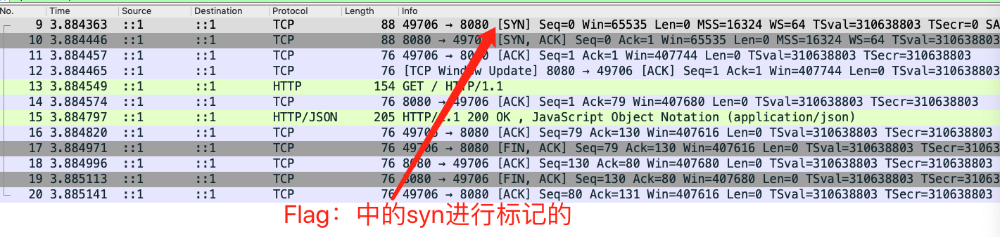

# tcp
千呼万唤使出来的tcp协议终于来了，我确实也很想早点赶出来tcp，奈何tcp协议内容实在太多了。确确实实很难把所有
知识点涵盖进来，只能通过wireshark进行实际抓包分析，其实理论的tcp协议实在太多文章了，虽然很多文章但是我还是
建议你去看一下tcp/ip 详解劵。今天我就点到即止，因为说透tcp，我确实还没有那个功底。

## 目录
- [一切始于连接](###一切始于链接)

### 一切始于链接
tcp的百度百科的翻译是这样的： tcp transmission controller protocol ，传输控制协议，是一种面向连接、可靠的
基于字节流的传输层通讯协议。然后它的目的是什么呢？ tcp的目的是在不可靠的网络环境当中提供可靠的端到端字节流而专门
设计的传输协议。

总结归纳一下就是下面几个点
- 传输控制协议
- 基于字节流
- 可靠的

我们说过IP层协议，IP层的内容可以查看IP这篇文章。IP层是一个不可靠的数据传输，但是IP层又是不能分割的一个部分，因为
IP更多的作用就是将数据从A传送到B，每次传输都需要基于IP的寻址、路由的跳转等等，主要目的就是为了让A
主机在复杂的网络环境中找到B主机。但是如果说IP经常丢包怎么搞？

### 一个TCP包

- source port : 源端口
- destination prot : 目标端口
- Sequence number :序列号 32位
- acknowledgment number ： 确认序号 32位
- header length ：头部长度 4位
- window ：16位
- checksum : 16位，和ip位校验一样
- urgent pointer :16位紧急指针
- Flags ：聚合字段，待会讲解

这个字段和header length 公用两个字节长度，前面的4bit 给到headerlength，后面12位就是这个flage的内容了。我简单
描述一下
- reserved ： 保留字段 3位
- nonce ： 也可理解位保留字段
- cwr ：拥塞窗口减少标志，用来标明接受到了ece标志的tcp包，并且发送方收到消息后通过减小发送窗口来降低发送速率
- ece： 用来在tcp三次握手时候标明一个tcp端是具备ecn功能。在数据传输过程中，用来标明接受到的tcp包的ip头部的ecn设置为
   11，标明网络堵塞
- urg ： 表示本段报文中是否存在紧急数据。只有这个字段为1的时候后面的urgent内容才有效
- ack ：表示前面的确认字段是否有效，当此字段为1的时候，ack的序号才是有效的，而且在tcp建立连接后的包ack都是1
- psh： 告诉对方这个包应该立刻给应用层而不是缓存起来
- rst： 表示是否重置连接，如果rst 说明出现严重问题必须释放连接
- syn：在建立连接的时候使用，用来做同步序号
    - 当syn =1，ack=0 这个包是用来创建连接的请求
    - 当syn =1 ，ack =1 说明这是一个回执包，表示对方统一建立连接
- fin ： 表示可以释放连接
    
这里面其实每个字段都是非常经典的，接下来我分析一下三次握手

### 三次握手的三个包
这次案例我通过三次握手给你看一下我们的实际tcp包长成什么的样子，方便你理解tcp三次握手

我先告诉你这个序列图就是整个httpget 交互流程，首先我们先分析标志位
- 客户端发包： SYN 包
- 服务端回包： SYN 、ACK 包
- 客户端回包： ACK包

三次握手中的三个包的标志位就是这样的了。一般来说处理标志位还有什么内容呢，就是seq 和ack 了，但是你要注意的是这个ack 和
ACK 是不相同的哟，ack 是指 acknowledgment number ，但是ACK是标志位。

- 客户端发包： seq ：x
- 服务端回包： seq : y ,ack : x+1
- 客户端回包： ack : y +1 

所以三次握手的内容就是seq 、ack 、ACK、SYN的组合，其实还是比较简单。但是整体还是需要你注意几个点！

- tcp 所有的包都有seq ，但是能不能用在于标志位SYN
- SYN 标志为1的时候只能是： 请求创建链接、同意创建链接两个步骤
- ACK 标志是：创建链接、创建链接后都会一直存在

### 四次挥手的四个包

上面告诉你了三次握手是什么样子的，那么我们再看看四次挥手
- 断开方发包： FIN、ACK
- 被动方发包： ACK
- 被动方发包： FIN、ACK
- 被动方发包： ACK
这大概是