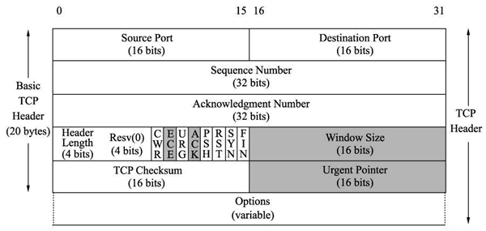

#TCP 报文解读
本来之前写了一篇巨长的关于tcp文章，但是后面读来几遍后感觉越读越不通畅，想着还是把这篇文章先做一下切分。
本来tcp就是一个巨幅制作，一篇文章肯定是讲不了的。

这篇文章旨在将tcp所有字段进行解读一下，方便理解tcp如何基于这些协议字段做到的消息排序、消息重传、拥塞控制
等等相关内容。

## 目录
- [tcp报文](###tcp报文)
    - [寻址字段](###寻址字段)
    - [序列字段](###序列字段)
    - [标志位字段](###标志位字段)
    - [其他字段](###其他字段)

### tcp报文

##### 寻址字段
- source port 发出端口
- destination port 目标端口

##### 序列字段
- seq  ： 序列号
- ack ： 确认序列号

##### 标志位字段
- header length： 4个bit
- reserved ： 保留字段，4个bit ，准确来说应该是三个保留位+ns（无意义的）
- cwr： 网络拥塞标志
- ece： 
- urg： 是否紧急
- ack： 确认标志位
- psh： 立刻把包交个上层应用
- rst： 重置这个链接
- syn： 
- fin：结束链接

#####  其他字段
- window ： 窗口数量
- checksum ： 总和数量
- urpoint ： 紧急指针

#### 注意点
 tcp 中没有包的长度，如果需要知道某个数据包长度可以用下面的算法
-  IP包总长度-ip header length - tcp header length 
