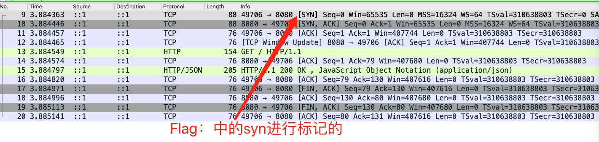
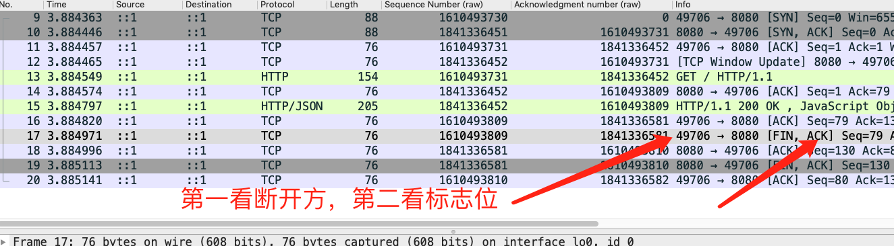

# 连接是基础
终于讲到我们的连接了，我先问个问题，为什么要有连接？为什么刚好是三次握手呢？

## 目录
- [三次握手](###三次握手)
    - [标志位](#####标志位)
    - [序列号](#####序列号)
    - [为什么需要三次握手](#####为什么需要三次握手)
- [四次挥手](###四次挥手)
    - [标志位](#####标志位)
    - [序列号](#####序列号)
- [总结](###总结)
### 三次握手

##### 标志位
- 客户端发包： SYN 包
- 服务端回包： SYN 、ACK 包
- 客户端回包： ACK包

##### 序列号以及确认序列号
- 客户端发包： seq ：x
- 服务端回包： ack : x+1，seq = y
- 客户端回包： ack : y +1 

这里可以总结几个点： 

- ack 始终和发送端的seq有关，所以名字相近：一个叫序列号一个叫确认序列号
- 握手期间，ack始终就是对方包+1 ，发送期间ack = 对方下一个包seq = 对方上一个包的seq +上一个包长度

##### 为什么需要三次握手
可以用两个包来进行握手吗？其实也是可以的，但是用三个包来握手可以避免什么问题呢？举个例子：某个网路存在多个
路径，客户端建立请求在第一条网络上，由于网络延时，第一个包没有到达服务器导致重发了。此时客户端发送第二个包
成功建立连接后断开连接，第一个包又达到了服务器，服务器正常处理请求，那么服务器又会给客户端发个syn 确认建立连接
包，此时又一个连接被创建，所以这就是浪费呀。如果说是三次，第二次服务器发包出来，客户端无视掉了就行了。

### 四次挥手

上面告诉你了三次握手是什么样子的，那么我们再看看四次挥手
##### 标志位
- 断开方发包： FIN、ACK
- 被动方发包： ACK
- 被动方发包： FIN、ACK
- 被动方发包： ACK

从实际图上看起来是这样的，但是第一个ACK是回复最后的服务器下发的包的，可以忽略掉
##### 序列号以及确认序列号
- 断开方：ack =0 ，seq =0 
- 被动方： ack =1 ，seq =0 
- 被动方： ack =1 ，seq =0 
- 断开方： ack = 1 ，seq=1

##### 四次挥手能保证连接断开吗
不能！ 一般来说四次挥手不能保证连接断开，有兴趣可以看看两军问题

### 总结
这里不是总结三次握手四次挥手，而是关于acknowlegment 和sequence两个内容

- 为什么连接的时候需要在ack上加一，因为要保证序列号以及确认序列号不一样
- 什么时候的序列号是可以一样的，fin包发送的时候 seq 和ack 是可以和上一个包同样的
- 在沟通tcp包的时候，一般来说seq = 上一个接受包ack = 上一个发送包的 seq +length 

