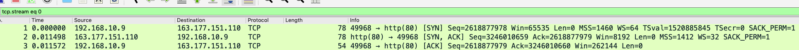
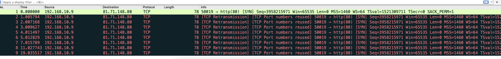
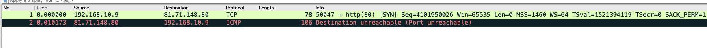

# 三次握手实战

## 目录
- [为什么需要三次握手](###为什么需要三次握手)
- [三次握手](###三次握手)
    - [握手成功](###握手成功)
    - [握手失败](###握手失败)
    - [握手失败通用套路](####握手失败通用套路)
- [windows scale](###windows scale)

### 三次握手
三次握手我们之前的tcp中也有讲到过，今天我们重新来通过抓包看看握手是怎么进行的。
我们回顾一下三次握手，这里为了查看握手的纯粹性，我们就不看win，mss这些字段了
- 客户端：发送syn ，进入syn_send 
- 服务端：收到syn包后，发送ack，syn ，进入syn_recv
- 客户端：发送ack ，进入establish
- 服务端：收到ack 后进入establish

这就是三次握手的全部流程了以及两端握手状态

### 为什么需要三次握手
关于为什么需要三次握手，其实很多人都有争论，上面也有三次握手的一个对照，我们对照着三次握手来进行
阐述一遍为什么需要三次握手，假设这样一个场景：我们只需要两次握手就可以建立一个连接。发起方发送一个
syn包过来，服务端回复一个ack，此时双方进入establish状态。 如果出现这样一个问题：就是网络滞留，
后面的四次挥手为什么会有2MSL的停留时间也是这个。

如果客户端发起了一次请求，第一个syn包在某个路由上被限制了或者说被排队了，客户端重发了一个syn，服务端
回了一个ack包，双方就建立了链接，此时双方就只是简单打个招呼就断开了，而后这个包，经过一段时间又到达了
服务端，服务端又响应一个ack，此时就在服务端建立了一个无效的链接，可能客户端收到ack后不处理，但是服务
器来说就占用了一个端口资源

#### 握手成功
我们首先看看握手成功的抓包

可以通过这个包info字段中看到的用中括号括起来的部分，是不是和我们一直描述的三次握手是一模一样的了。
因为是测试我每次测试完都会重启路由，所以不要乱尝试使用我这个ip，回到主题。我们还是总结之前已经总结
过的道理

1. syn包只存在握手的两个阶段
2. 两端的mss一般不一致，win也是不一致的，都是在握手阶段协商的
3. 握手的时候两边的状态一定记清楚：syn_send,syn_recv 
4. windows scale
#### 握手失败
在应用软件开发过程中应该还是很少看到这个握手失败的，一般环境都是运维同事给配好的，但是如果说我们
在开发一个应用的时候，你可以精确的知道是服务端的错误还是客户端的错误，是服务端丢包还是拒绝，这一定
能让你在开发过程中成为大家都信服的技术专家。如果在小技术团队，那么老板就能发现你的特殊价值了。所以
精准定位错误是一个硬性本领，一定要学会。

我这里有一个包，在做服务端联通性测试的时候进行抓包。在图中可以看出，服务端和客户端的某一方出现错误了
这里就有一个原则，你拿到一个包首先得判断一下这个包是哪一方抓包得到的。按照上面总结的，syn存在于握手初期，

1.tcp握手是存在重试，而且第一个包重试是1秒钟，后续包都会比上一个多一些时间间隔。
2.tcp握手重试次数：linux 下设置 net.ipv4.tcp_syn_retries，同样的还有一个最大握手重传次数：
  tcp_synack_retries
3.tcp包的重发遵循指数退避原则，后面再讲解

在上面的过程中我们发现我们发出的包都没有回复，这个原因具体是什么呢？这个原因是多种多样的，我们其实并不好下
定论。所以我们会在下面总结一下，抓包的一些经验。在这里我们会发现又存在一个包发送过来，但是被服务端直接拒绝了
，我们发现回包是一个ICMP，和上面问题一样，我并不能给你轻易的下结论，但是这里存在通用的套路

#### 握手失败通用套路
在上面的抓包过程中，我们中间出现两个错误案例，一个是包不可到达，一个是包被拒绝，这两个例子为什么我不能轻易
断定问题是出现在那边呢？ 因为本身网络从来不是一个容易的话题，解题永远是有套路的。

- 包不可到达

我们得回顾一下我们发包流程，是客户端发包给服务器，服务器会包说我收到了，那么两个部分都会存在问题，在发包可能
没有到达服务器，也有可能服务器发包没有到达客户端

1. 客户端、服务器分别抓包确认哪个过程丢包
2. 找出中间的所有流程：因为每个公司业务都不一样，有的业务走LB，有的不走，所以找出变量进行多番测试
3. 找到问题，总结

- 包被拒绝

说明包被收到了，但是被拒绝了，此时可以确定是服务器的问题

1. 客户端、服务器抓包，确定服务器的问题
2. 找到服务器中间的经过的流程
3. 找到问题总结

### windows scale
TCP 最初是七八十年代的产物，1981 年 9 月定稿的RFC793才第一次正式确定了 TCP 的标准。当时的网络带宽还
处于“石器时代”，机器的带宽只有现在的百分之一，那么 TCP 接收窗口自然也没必要很大，2 个字节长度代表的 65535 
字节的窗口足矣。

但是后来网络带宽越来越大，65535 字节的窗口慢慢就不够用了，于是设计者们又想出了一个巧妙的办法。原先的 Window
 字段还是保持不变，在 TCP 扩展部分也就是 TCP Options 里面，增加一个 Window Scale 的字段，它表示原始 
 Window 值的左移位数，最高可以右移 14 位。
 
但是这里需要注意的一点是：win scale 在只存在tcp握手包中，如果没有抓到握手包的话可能会错过真正的windows
在tcp option 当中的window scala 存在几个字段
1.kind =3
2.length =3，总共三个字节，这个option
3. shift count：6 ，win字段* 2^6 = 真实窗口大小

值得注意的是
1. 如果一方没有scale 就不能开启这个选项了